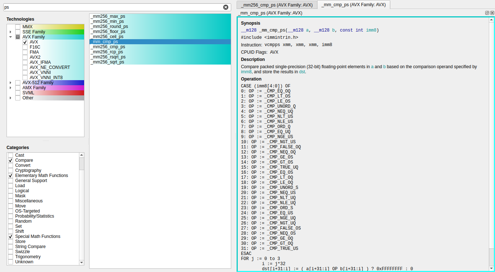

# MinIGuide - Minimalistic Intrnisics Guide #

Simple and fast offline version of [Intel® Intrinsics Guide](https://www.intel.com/content/www/us/en/docs/intrinsics-guide/index.html) for desktop.

# Features

* Minimalistic UI
* Fast. Takes under a second to start up
* Remembers previous session

# Usage

Download [data](https://www.intel.com/content/dam/develop/public/us/en/include/intrinsics-guide/data-3-6-6.xml).
On the first run select the data file in the file dialog.

# Dependencies

* C++17 compatible compiler (tested with GCC-11)
* CMake 3.16 or newer
* Qt5 with widgets and XML modules (tested with 5.15)

The program was tested only on linux, but probably can be built on other platforms without much effort.

# License

GNU GPL v3
